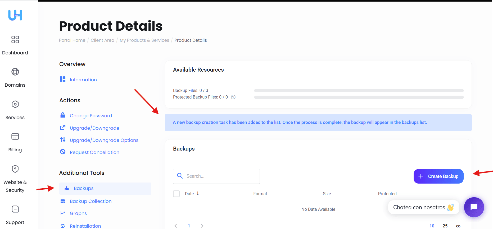
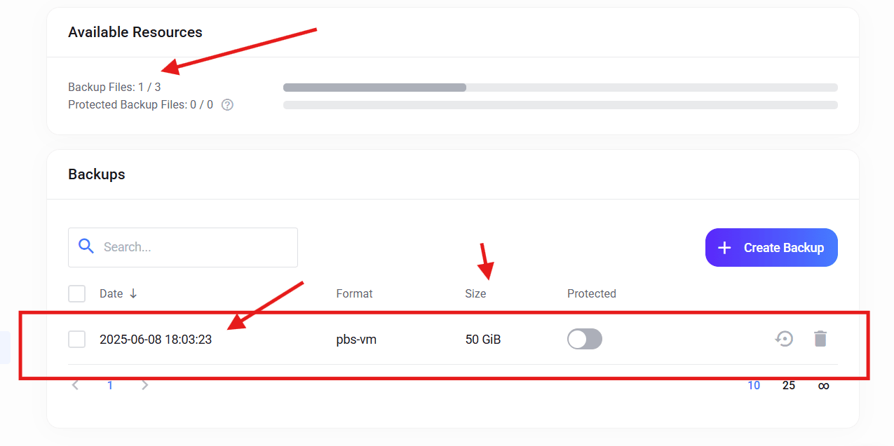

# 1.2. Respaldo Inicial de tu VPS: Guía Esencial

Antes de empezar a configurar tu VPS, es fundamental realizar un **respaldo inicial**. Esto crea una copia de seguridad limpia y completa de tu sistema en su estado original, lo cual es invaluable en caso de problemas futuros o configuraciones incorrectas.

## Modo de Respaldo Recomendado: Stop (Apagar)

Para tu respaldo inicial, el modo recomendado es **Stop**. Esto significa que tu VPS se apagará completamente antes de que se realice la copia de seguridad.

* **Ventaja clave:** Ofrece la **máxima consistencia de datos**. Al estar completamente apagado, no hay riesgo de que los datos estén incompletos o en un estado inconsistente. Es como hacer una fotocopia de un libro cerrado.
* **Ideal para el inicio:** Dado que tu VPS no tiene nada funcionando aún, no hay interrupción de servicios. Esta es la opción más segura para asegurar un respaldo perfecto de tu sistema base.

**Importante:** No necesitas apagar el VPS manualmente antes de iniciar el respaldo. Cuando selecciones la opción "**Stop**" en la interfaz de tu proveedor, el sistema se encargará de apagar tu VPS de forma segura, realizar el respaldo y luego dejarlo apagado. Deberás iniciarlo manualmente después de que el proceso haya terminado.

---
## Compresión Recomendada: ZSTD

Para la compresión de tu respaldo, se recomienda usar **ZSTD** (Zstandard).

* **Ventajas de ZSTD:** Es un algoritmo de compresión moderno que ofrece una excelente combinación de **velocidad y eficiencia**. Esto significa que tu respaldo ocupará menos espacio de almacenamiento y se completará más rápido, lo que es beneficioso tanto para ti como para el proveedor del servicio.

---
## Culminación del Respaldo Inicial: En UltaHost

El respaldo puede tomar aproximadamente 15 minutos, se recomienda actualizar la pagina en UltaHost **F5 o actualizar con el navegador** (Presionar tecla F5).

* **Importante** Al culminar deben arrancar manualmente el servidor **Presionar el START**. Cuando se culmina el respaldo el servidor queda detenido o apagado.

---
[Volver al Menú Principal](index.md)

