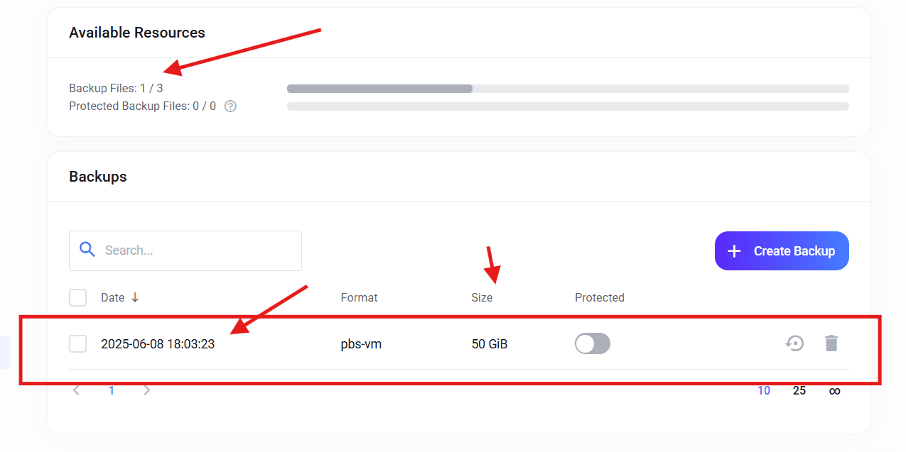

# 2.1. Conexión Vía SSH a tu Servidor VPS

Para gestionar y configurar tu VPS, necesitarás conectarte de forma segura a él. La conexión SSH (Secure Shell) te permite ejecutar comandos y acceder a tu servidor de forma remota. Aquí te mostramos cómo hacerlo usando **Git Bash** (para usuarios de Windows) y **PuTTY**.

---

## 2.1.1. Conexión SSH Usando Git Bash (Windows)

Git Bash es una excelente herramienta para usuarios de Windows que proporciona un entorno de línea de comandos similar a Linux, incluyendo el cliente SSH.

### Requisitos Previos:
* **Git Bash Instalado:** Si no lo tienes, puedes descargarlo e instalarlo desde el sitio oficial de Git: [git-scm.com/downloads](https://git-scm.com/downloads).

### Pasos para Conectarse:

1.  **Abre Git Bash:** Busca "Git Bash" en el menú de inicio de Windows y ábrelo. Verás una ventana de terminal.

2.  **Obtén los Datos de tu VPS:** Necesitarás la siguiente información de tu proveedor (por ejemplo, Ultahost):
    * **Dirección IP de tu VPS:** (Ej: `192.0.2.10`)
    * **Nombre de Usuario SSH:** (Generalmente `root` para el primer acceso, a menos que tu proveedor te dé otro)
    * **Contraseña SSH:** La que te proporcionó tu proveedor.

3.  **Ejecuta el Comando SSH:** En la ventana de Git Bash, escribe el siguiente comando, reemplazando `usuario` con tu nombre de usuario SSH y `tu_ip_vps` con la dirección IP de tu servidor:

    ```bash
    ssh usuario@tu_ip_vps
    ```
    **Ejemplo:**
    ```bash
    ssh root@192.0.2.10
    ```

4.  **Acepta la Huella Digital (Primera Conexión):** La primera vez que te conectes a un servidor, verás un mensaje de advertencia sobre la autenticidad del host y la huella digital (fingerprint). Escribe `yes` y presiona **Enter** para continuar. Esto añadirá la huella digital del servidor a tus "hosts conocidos".

    ```
    The authenticity of host 'tu_ip_vps (tu_ip_vps)' can't be established.
    ECDSA key fingerprint is SHA256:XXXXXXXXXXXXXXXXXXXXXXXXXXXXXXXXXXXXXXXXXXX.
    Are you sure you want to continue connecting (yes/no/[fingerprint])? yes
    ```

5.  **Introduce tu Contraseña:** Después de aceptar la huella digital, se te pedirá la contraseña del usuario. Escríbela y presiona **Enter**. Ten en cuenta que, por seguridad, **no verás los caracteres mientras escribes la contraseña**.

    ```
    usuario@tu_ip_vps's password:
    ```

6.  **¡Conexión Exitosa!** Si la contraseña es correcta, habrás iniciado sesión en tu VPS y verás el prompt de comandos de tu servidor. ¡Ya puedes empezar a configurarlo!

---

## 2.1.2. Conexión SSH Usando PuTTY (Windows)

PuTTY es un cliente SSH popular y gratuito para Windows, conocido por su interfaz gráfica.

### Requisitos Previos:
* **PuTTY Instalado:** Si no lo tienes, puedes descargarlo desde el sitio oficial: [putty.org](https://www.putty.org/).

### Pasos para Conectarse:

1.  **Abre PuTTY:** Busca "PuTTY" en el menú de inicio de Windows y ábrelo. Se abrirá la ventana de configuración de PuTTY.

2.  **Configura la Sesión:**
    * En el campo **"Host Name (or IP address)"**, introduce la **Dirección IP de tu VPS**. (Ej: `192.0.2.10`)
    * Asegúrate de que el puerto **"Port"** esté en `22` (el puerto estándar para SSH).
    * Verifica que **"Connection type"** esté seleccionado como `SSH`.

    
    *(Imagen de ejemplo: Captura de pantalla de la ventana de configuración de PuTTY mostrando los campos "Host Name", "Port" y "Connection type").*

3.  **Opcional: Guarda la Sesión:** Para no tener que escribir la IP cada vez, puedes darle un nombre a la sesión en el campo **"Saved Sessions"** y hacer clic en **"Save"**. Así, la próxima vez, solo tendrás que cargarla.

4.  **Abre la Conexión:** Haz clic en el botón **"Open"**.

5.  **Acepta la Alerta de Seguridad (Primera Conexión):** La primera vez que te conectes a un servidor, PuTTY mostrará una advertencia de seguridad sobre la clave de host. Haz clic en **"Accept"** para continuar. Esto guardará la clave del servidor en tu registro para futuras conexiones.

    
    *(Imagen de ejemplo: Captura de pantalla de la ventana de alerta de seguridad de PuTTY).*

6.  **Introduce tu Nombre de Usuario:** Se abrirá una ventana de terminal y se te pedirá **"login as:"**. Escribe tu **nombre de usuario SSH** (generalmente `root`) y presiona **Enter**.

    ```
    login as: root
    ```

7.  **Introduce tu Contraseña:** Luego se te pedirá la contraseña. Escríbela y presiona **Enter**. Al igual que en Git Bash, **no verás los caracteres mientras escribes la contraseña**.

    ```
    root@tu_ip_vps's password:
    ```

8.  **¡Conexión Exitosa!** Si la contraseña es correcta, habrás iniciado sesión en tu VPS y verás el prompt de comandos. ¡Felicidades, ya estás conectado!

---

[Volver al Menú Principal](index.md)espacio de almacenamiento y se completará más rápido, lo que es beneficioso tanto para ti como para el proveedor del servicio.


<br>
<br>
<br>
---
## Culminación del Respaldo Inicial: En UltaHost

El respaldo puede tomar aproximadamente 15 minutos, se recomienda actualizar la pagina en UltaHost **F5 o actualizar con el navegador** (Presionar tecla F5).

* **Importante** Al culminar deben arrancar manualmente el servidor **Presionar el START**. Cuando se culmina el respaldo el servidor queda detenido o apagado.




---
[Volver al Menú Principal](index.md)


